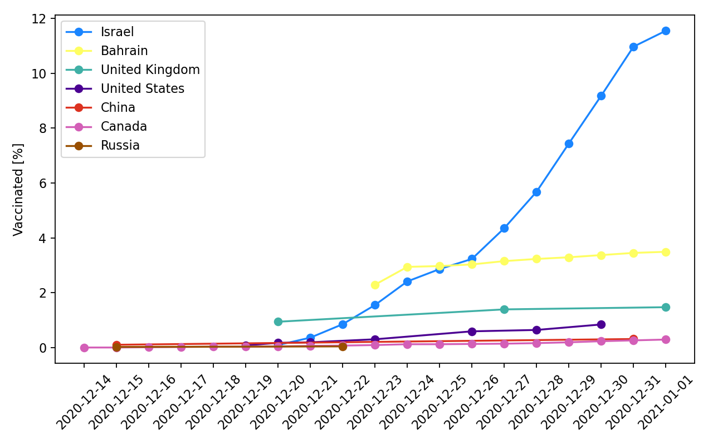
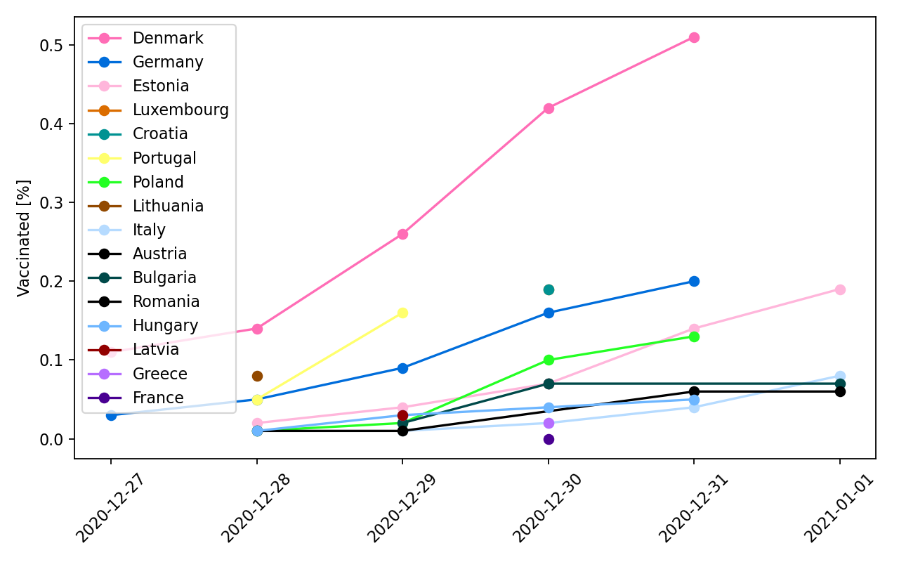

# covid-vaccination-monitor

Reads the latest numbers from the [github repository of Our World in Data](https://github.com/owid/covid-19-data/tree/master/public/data/vaccinations), and creates line charts for two sets of countries:
1. Big countries and forerunners (currently Israel, Bahrain, United Kingdom, United States, Canada, China, Russia, European Union, Japan)
2. Several European countries for which data is available (currently Portugal, Denmark, Lithuania, Germany, Estonia, Latvia, Italy, Poland, Romania)

## Output

## Used python libraries:
* pandas
* altair

